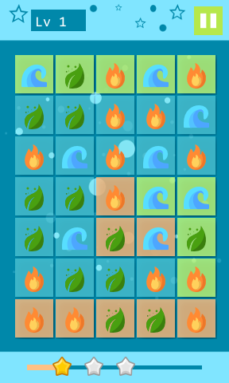

# MatchLand
**The more icons you connect, the more land you can spread.** 

Icons and the color of land correspond. For example, fire to red, thunder to yellow and wave to colorless. So, if you choose fire icon, you need to spread red land to win. However, as you can not overwrite the color of land where the enemy has gotten, it is necessary to make there colorless with wave icon for stage complete. 

  
  

## Download 
- [desktop](https://github.com/mmorihiro/matchland/releases) 
## License 
[Apache License 2.0](https://github.com/mmorihiro/matchland/blob/master/LICENSE)
